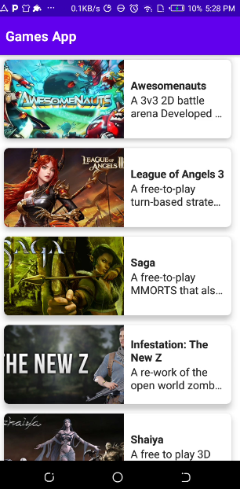
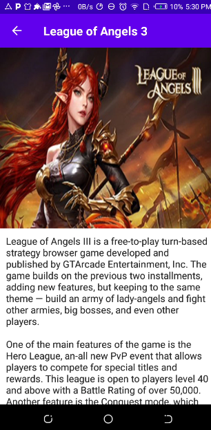

# GameApp
 **🚧 Project Status: Under Active Development 🚧** 
 <br> Android App that uses Retrofit and Jetpack Compose to easily consume a gaming API and display information about popular games. 
The app allows users to browse a list of games and view detailed information about each one. 
The app has a clean, intuitive user interface built with Jetpack Compose, making it easy to use and navigate. </br>

## Libraries

- Retrofit2
- Coil
- Compose Navigation
- Hilt Navigation
- LiveData
- ViewModel
- Dagger Hilt

## Features

- Show a list of games
- See the details of each game


## API Reference

#### Live games list

```http
  GET https://www.freetogame.com/api/games
```

| Base Url                          | Parameter | Type     |
|:----------------------------------|:----------|:---------|
| `https://www.freetogame.com/api/` | `games`   | `string` |

#### Return details from a specific game

```http
  GET https://www.freetogame.com/api/game?id=452
```

| Base Url                          | Parameter     | Type  | Description              |
|:----------------------------------|:--------------|:------|:-------------------------|
| `https://www.freetogame.com/api/` | `game?id=452` | `int` | **Required**. id of game |

## Documentation
[Documentation](https://www.freetogame.com/api-doc)

![App Screenshot]



